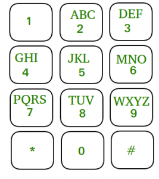

# Descrition

A simple app that makes words into phone numbers.

i.e: +1346loveyou -> +13465683968 (look the image below)



### Example input:

```bash
$ # Ask user a phone number, in the console.
$ What is your phone number? +1346loveyou
```

### Example output:
```bash
$ # Print the number using only this simbles:  |, _, -, /, \ .
          ____
   _     /    |
 _| |_  /_/|  |
|_   _|   _|  |_   ................
  |_|    |______|
```


### Getting started.

Note: windows developers should use python and pip rather than python3 and pip3 in the following commands:

```bash
$ pip3 install -r requirements.txt
$ # Run all the tests:
$ python3 -m unittest
$ # Run specific test:
$ python3 -m unittest tests.test_symbol_factory.TestPhone
```


### How to debug?

```pytho
# Place this line in the place were you want to start to debug.
import ipdb; ipdb.set_trace# break point
# You will have reference to all the variables that were previous set.
# write `c+enter` to jump to the next `import ipdb; ipdb.set_trace()` line.
# write `n+enter` to go to the next line.
```

<img src="./readme_images/ibdb_console.gif" width="1000 px